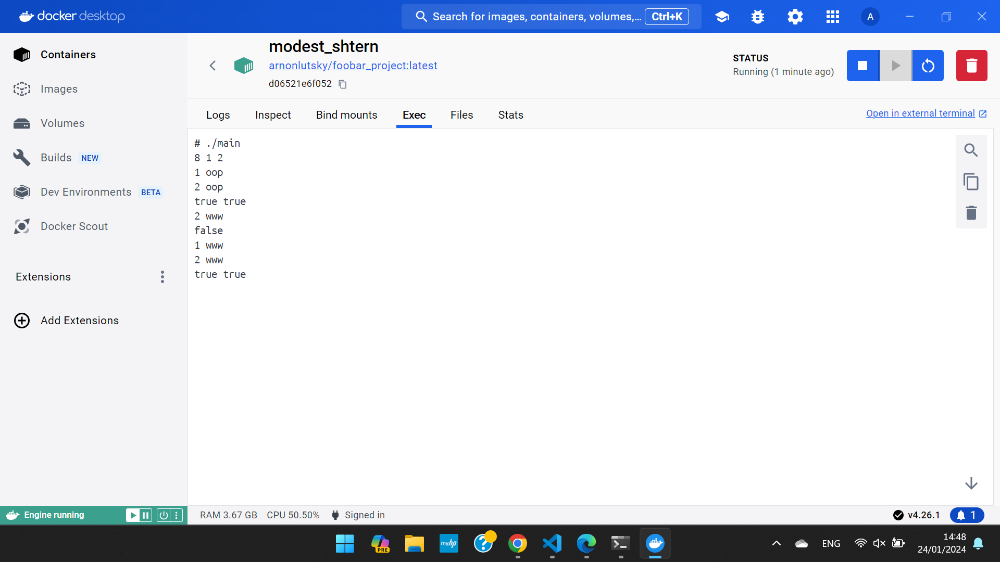
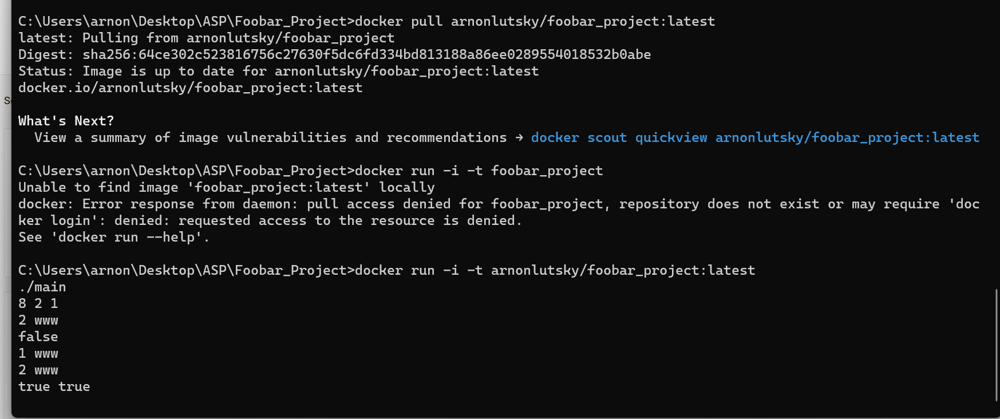

# Foobar_Project

How to compile and run our Project:

COMPILE: in the src dir - ```g++ -o main main.cpp App.cpp  BloomFilter.cpp HashNo1.cpp HashNo2.cpp AddUrl.cpp CheckUrl.cpp ConsoleMenu.cpp```

RUN:  ./main

JIRA explanantion:

We started by reading the exercise a few times and understanding all components.
Then we decided how to divide the project between all the teammates.
After that everyone wrote his own tasks in the Jira and we checked that all tasks were covered.
We started working on the project and everyone updated his tasks and what he was currently working on.
Every crucial step was written in the Jira so everyone could know where we are standing and what needs to be done.

TDD:

We wrote the BloomFilter in the TDD method as expected.
Our process was as followed:
1. Writing a test and failing.
2. Writing code to pass the test.
3. Refactoring to improve the code


After we finished writing the BloomFilter class we refactored it again to improve our code and make it more abstract and loose-coupled from the hash functions.
We extracted the whole hash Funcs mechanism out of the bloom filter in order to make it less dependent.
We then wrote a simple main that is running the BloomFilter and getting inputs from the user.
Then we started to refactor the main to get OOP classes to have the MenuCommands which will be responsable for getting the input from the user and performt he
action in the BF without the BF even knowing about the task neither the command. 
By doing so we managed to achive a smaller and more compact main function.
We then found out that our BloomFilter needs to be refactored and other files needed also to 
be changed.
We continued refactoring and making the code more OOP, abstract and readable, while making sure that after every single step we still pass all tests.
Our final code contains the following main components: 

1. BloomFilter - the blomfilter asked to be coded in the exercise.
2. App - the file which create the BF and runs the program loop.
3. ConsoleMenu - getting the input that indicates us the length of the bloomfilter and the number of hash functions used, and after that supplies the new tasks for the BF to be made.
4. main- creating an APP object and calling APP's run fucntion.
5. HashFunc - an abstruct class containing the basic mechanism for the others HashFunctions to come.
6. HashNo1,2- specific hash functions that were asked to use.
7. ICommandable - an interface for the commandable classes with the "execute" Func.
8. CheckUrl- checking if a specific URL is in the bloomfilter (separated to true-true and true-false).
9. AddUrl- adding a URL to a bloomfilter.


DOCKER:

For the docker part, we created a yml file to create and push a new image to dockerhub on every release.
We also created a Dockerfile for the yml to use.

Dockerfile explanation: 
Copyies all cpp files and relevant header files to the machine, compiles the cpp files and runs the created exe file.

Docker push-to-hub explanation:
on release, the yml file logins to docker hub, downloads builds and pushes an image of the program to dockerhub.

To run the image, run the following commands in the command line, while in the project directory:
"docker build -t foobar_project ." - to build the image **Improtant - add the dot at the end of the command**

"docker run -i -t foobar_project" - to run the image. you can then input the array size along with the hash functions.
now you're ready to blacklist all of the unwanted urls and check for blacklisted ones.
alternativly, run:
"docker pull arnonlutsky/foobar_project:latest" to pull the image created on release - works only with required premissions because the repository is private.
"docker run -i -t arnonlutsky/foobar_project:latest" - to run the pulled image.

Proof that the image pushed on relase works:



wiki - https://github.com/arnonLuts/FaceBar_Server/wiki
